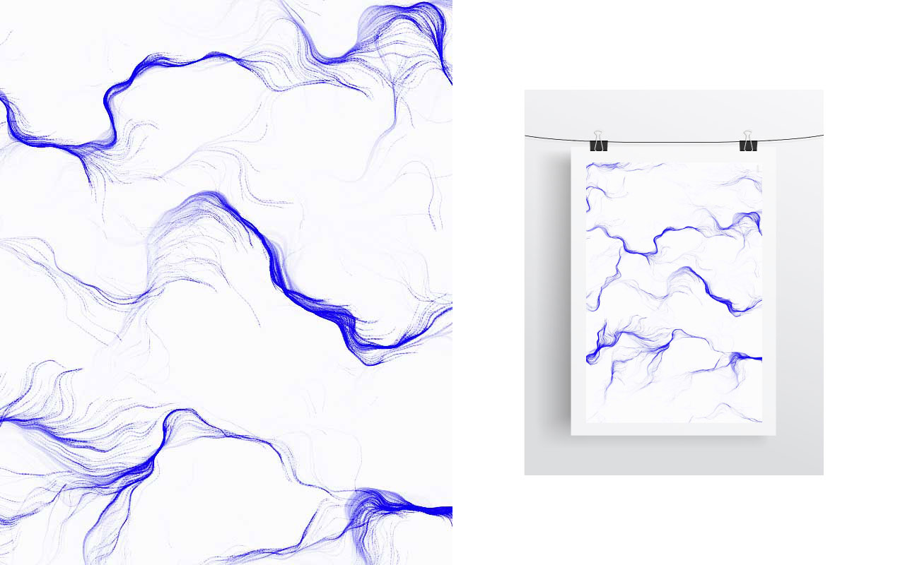

# intellagent

Sometimes used in the context of artificial intelligence, the idea of creating 'agents' means to dynamically generate objects while setting a set of rules for their behavior. This series of experiments, made with openFrameworks, aims to capture their visually captivating paths and to an extent, to apply the resulting compositions to other mediums.

